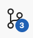

<!-- markdownlint-disable -->
# Om hvordan endre disse sidene

Merk: Sidene er satt opp for å være lette å jobbe med, inkludert at vi har
versjonskontroll som gjør at flere av oss kan jobbe med dem samtidig uten å
tråkke hverandre på tærne.  Det er derfor viktig at ikke noen bare går inn og
endrer på siten uten å bruke alt dette; endringene deres vil bli overskrevet av
de som bruker dette.

## Om eleventy (bruk og opplasting)

Vi bruker eleventy for å slippe repetere biter med meny etc.  Den lager en
statisk site, men har templating for å gjøre det lett for oss å utvikle uten å
repetere mye overalt. Her er hvordan gjøre ting med siten for å
installere/bygge/laste opp; template-system og struktur er dokumentert nedenfor.


## Utviklings-kommandoene

**Førstegangs oppsett**

1. Installer `npm` og `git` hvis du ikke har dem.
2. Hvis du ikke gjør utvikling på ting som er lagret på Github allerede:
    1. Installer [github cli](https://github.com/cli/cli#installation)
    2. Følg instruksjonene  [om hvordan sette opp github-autentisering via `gh cli`](https://docs.github.com/en/get-started/git-basics/caching-your-github-credentials-in-git#github-cli).  De skal si noe a la 
       * In the command line, enter `gh auth login`, then follow the prompts.
       * When prompted for your preferred protocol for Git operations, select HTTPS.
       * When asked if you would like to authenticate to Git with your GitHub credentials, enter Y
       * For more information about authenticating with GitHub CLI, see [`gh auth login`](https://cli.github.com/manual/gh_auth_login).

3. Installer [eleventy](http://11ty.dev):

```shell
npm install @11ty/eleventy
```

**Oppsett for hvert "workspace" (du kan ha fler på en maskin)**

Lag et workspace med koden:

```sh
# Sjekk ut koden
$ git checkout https://github.com/eivindeklund/slottfjellet
$ cd slottfjellet
$ cp dotenv.example .env
# Endre .env til å ha de variablene som er viktige for oss.  Du må få dem fra
# noen som vet om dem; ihvertfall Daniel og Eivind har dem.
$ $EDITOR .env
```

Sett igang server for å kunne teste endringer:

```sh
$ npx @11ty/eleventy --serve --port=8000
```

Gå til http://localhost:8080/; når du endrer noe i kildefilene vil det stort
sett øyeblikkelig dukke opp her.  Det kan noen ganger være noe caching i veien;
hvis endringer ikke dukker opp, press Ctrl-Shift-R (på Linux/Windows) eller
⌘-Shift-R (på Mac).

> Hvis du skal ha flere kopier av siten oppe samtidig (fra forskjellige
> workspaces) må du bruke forskjellig port til hver av dem.

Se nedenfor for hvor de forskjellige filene du kan endre er (oftest `src/*.html`
og `src/_include/*.html`).

Når du er ferdig med å gjøre endring trenger du lagre dem i git lokalt, sende
dem til github, og kjøre et script for å legge dem ut.  Jeg foretrekker å bruke
den integrerte git-støtten i [VS Code](https://code.visualstudio.com/download)
(gratis, lett å installere på Linux, Mac og Windows).  Hvis du bruker den får du
en greie du kan klikke på på venstre side som ser ca sånn ut:



Deretter skriver du beskrivelse og trykker "⬆Commit & Push".  Dette kan også
gjøres fra kommandolinje men er litt fumlete; kommandoene du leter etter er som
regel `git add`, `git commit` og `git push`, med `git mv` og `git rm` for
flytting og fjerning.

Når du er ferdig med å endre og commit'e og pushe, kan du legge ut websiden.

Da må du først bygge den:

```sh
$ npx @11ty/eleventy
```

Dette skriver hele siten til  `_site`, akkurat som det skal lastes opp (som
`bin/deploy.sh` gjør.)

Deretter kan du sende den til å bli aktiv:

```sh
$ ./bin/deploy.sh
```

Deploy vil sjekke at alt er bygd riktig og at alt er riktig med git,
ta en datert backup av den live siten lokalt (til `_backup/`), laste backupen
opp til `slottsfjellet-backups` på hosting, og til slutt laste opp selve siten.

Deploy har en del kommandolinje-switcher som kan brukes til å droppe sjekker eller
kjøre gjennom alt "som test" etc.  For å se hva som er av switcher kjør

```sh
$ ./bin/deploy.sh --help
```

## Filstruktur og includes

Alt som skal ut på websiden kommer fra `src/` - det som ikke er i `src/` er
infrastruktur.

Fil eller dir | Innhold
---|---
`bin/` | For små-programmer/scripts som hjelper oss vedlikeholde.
`bin/deploy.sh` | For å kopiere hele siten til FTP.  Kjør `./bin/deploy.sh --help` for å se mer muligheter.
`.env` | Sett variabler som trengs for å kunne laste opp.  Du må få disse fra noen som har tilgang.
`.eleventyignore` | For å [sette opp filer som ikke skal kopieres/prosesseres](https://www.11ty.dev/docs/ignores/).  Per idag brukes den bare så vi kan legge README.md filer rundt hvor som helst uten at de gjøres om til `README.html`
`.gitignore` | Liste av filer som ikke skal med i versjonskontroll (`git`).
`dotenv.example` | Eksempel for `.env` med kommentarer.
`eleventy.config.js` | Oppsett for kopiering av filer etc.
`README.md` | Denne filen.  Dokumentasjon på struktur, hvordan oppdatere, etc.
`src/` | Input-data for å bygge websiten.  **Alt som skal kopieres herfra må settes opp i `eleventy.config.js`!**
`src/*.html` | Der websidene våre kommer fra :-)
`src/_data/` | Greier for eleventy.  Det eneste jeg vet om bruk av er `permalink.js` men jeg antar det finnes mer en kna legge her.
`src/_data/permalink.js` | Eleventy config for hvordan sette opp filnavn.  Per default kopierer eleventy foo.html til foo/index.html så foo.html kan kommes til som slottsfjellet.org/foo, men vi har allerede slottsfjellet.org/foo.html i bruk, så vi må gjøre noe mer oppsett før vi kan skifte format.
`src/_extra_for_root` | Filer som skal kopieres til `/`, utenom `*.html`.  Separert ut for å ha minst mulig rot når en endrer HTML-filene.  `src/_includes` | Filer som inkluderes i de andre filene for å bygge websiten.
`src/_includes/content_body_*.html` | div's med grå bokser som settes inn i forskjellige andre sider.
`src/_includes/head.html` | Innhold til `<head>` i sidene våre.  Tar parameter `title` via `{% render "head.html", title: "En Tittel Her" }` der `En Tittel Her` vanligvis er `Slottsfjellet Spillforening`.
`src/_includes/header.html` | Topp-header på siden, med logo og "Slottsfjellet Spillforening"
`src/_includes/footer.html` | Det som kommer på slutten av siden.  For øyeblikket reklamen med Tabletopbattle, Outland, og Togbutikken.
`src/_includes/nav.html` | Nav-bar.  Kommer så langt alltid sammen med `header.html` så burde inkluderes derfra. Se TODO
`src/_includes/infobox_om_oss.html` | Om oss-box, med HTML-struktur som er litt annerledes enn i `content_body_*.html`.  Burde gjøres om til å ha samme strukture.  TODO

Includes brukes som følger:

1. Putt en fil for inkludering i `src/_includes/et_navn.html`.  Dette kan være
   en straight fil, eller den kan includere mer ting for inkludering eller
   ekspandering.  (Teknisk sett er dette en template i liquid-format.)
2. Putt `{% render "et_navn.html" }` eller `{% render "et_navn.html", en_variabel: "en verdi" }` der du vil inkludere.
3. Putt `{{ en_variabel }}` der du vil legge inn verdien.


## Nav-meny og hvordan legge til sider i den

Nav-menyen viser hvilken side som er aktiv via CSS; "linken" til den aktive
siden blir bold, svart og kan ikke klikkes på.

Dette fungerer via tre ting tilsammen:

* Hver side har en CSS-klasse `<side>-page` på `body` som sier hvilken side en er i.  For `ttt.html` (Tønsberg TableTop) er det `<body class="ttt-page">`, etc.
* Hver link i nav'en har en CSS-classe `<side>-link` som sier hvilken side den hører til.  For linken til `ttt.html` er det `<div class="nav-item gray-box ttt-link">`
* I `style.css` er det en CSS-selektor som velger kombinasjonen `.<blah>-page .<blah>-link` og skifter stilen.

Alle disse må endres sammen hvis en skal legge til en ny side.

Bakgrunn:

> Vi prøver unngå for mye Javascript for å ikke måtte vedlikeholde noe komplisert.
>
> Per oktober 2025 har ikke ren CSS noe som lar oss gjøre dette med mindre
> repetisjon enn det ovenfor. `:local-link` er i draft men ikke implementert noe
> sted, og det er ingen måte å gjøre prefix match mellom to css-regler (så vi
> kan ikke matche foo-page og foo-link uten å liste det for hånd.)
>
> Vi kunne brukt eleventy til å gjøre dette i det HTML blir skrevet om, men det ville
> gjøre det mye vanskeligere å gå tilbake til manuell endring hvis vi skulle
> måtte gjøre det.


## Tidssensitive elementer

Vi har Javascript-basert støtte for å få elementer til å dukke opp og forsvinne
ved å tagge dem med `data-show-after` og `data-hide-after`.  Hvis det av en
eller annen grunn skulle trenges en annen tidssone en `Europe/Oslo`, legg til en
`data-timezone`.

Eksempel på bruk:

```html
    <li data-hide-after="2025-12-02T22:00">
      <span class="only-in-index">Tirsdag på Solhaug (juleavslutning): </span
      ><span class="datetime">2. des kl 17:30</span>
    </li>
```

### Debugging av tidssensitive elementer

Skriptet har støtte for å overstyre `now` når du
trenger å feilsøke visning som avhenger av tid ved å sende `&debug_time=en-iso-lignende-tidsstreng`.
Den tolker i tidssonen Europe/Oslo.

Eksempel: `http://slottsfjellet.org/tirsdag.html?debug_time=2025-11-01T15:00:00`

Format: `YYYY-MM-DD` eller `YYYY-MM-DDTHH:mm` (sekunder er valgfrie). Hvis
strengen inneholder en tidssone (Z eller +/-hh:mm) brukes den i stedet.
Elementer som har `data-debug` vil logge synlighetsinformasjon (`time-visibility`)
til konsollen slik at det er lett å se hvilken «now» som ble brukt.

# TODOs

Mulig vi skal endre `./bin/deploy.sh` til å gjøre bygging også istedenfor å bare
sjekke build, og å sette permissions så folk ikke kan endre feil sted.

## Referanser

For mer avansert eleventy-struktur:
https://www.njfamirm.ir/en/blog/eleventy-folder-structure-guide/
